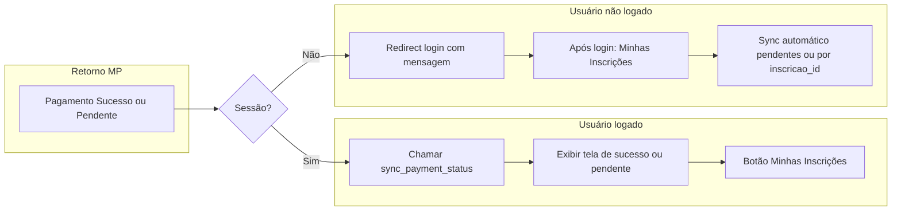

# Plano: Fallback de sync na experiência de retorno do pagamento

## Contexto

- O **webhook** do Mercado Pago ainda não está funcionando de forma confiável.
- O **api/participante/sync_payment_status.php** consulta a API do MP, confirma o pagamento e atualiza `inscricoes` e `pagamentos_ml`, permitindo dar seguimento ao fluxo.
- Hoje as páginas de retorno (sucesso/pendente/erro) chamam **api/participante/update_payment_status.php**, que **não** consulta o MP e **não** cria/atualiza `pagamentos_ml`; apenas aplica o `collection_status` vindo da URL (dado que pode faltar ou atrasar).

## Objetivo

Na experiência de inscrição, ao detectar o retorno do pagamento (click/redirect do Mercado Pago), usar a **sync como fonte da verdade** (fallback até o webhook estar estável) e, se o usuário não estiver logado, redirecionar para login com mensagem clara e levá-lo à área do participante para confirmar a inscrição.

---

## Proposta (visão produto)

1. **Retorno com usuário logado**  
   Na página de sucesso (e opcionalmente na de pendente), chamar **sync_payment_status.php** assim que a página carregar. Assim o status e o registro em `pagamentos_ml` ficam corretos mesmo sem webhook. A tela de "Pagamento aprovado" continua sendo exibida; o usuário pode seguir para "Ver Minhas Inscrições" com dados já atualizados.

2. **Retorno com usuário não logado**  
   Se a sessão tiver expirado (ou o usuário abrir o link de retorno em outro dispositivo), redirecionar para a **tela de login** com uma mensagem objetiva: *"Acesse sua área para confirmar sua inscrição."* Após o login, enviar o usuário para **Minhas Inscrições** (e disparar o sync daquela inscrição). A confirmação visual fica na área do participante.

3. **Comportamento idempotente**  
   O `sync_payment_status.php` já é idempotente. Chamá-lo no retorno (sucesso/pendente) não causa efeito colateral se o webhook já tiver rodado ou se for chamado mais de uma vez.

---

## Fluxo resumido

---

## Implementação

### 1. Páginas de retorno: usar sync como fonte da verdade

**Arquivos:** frontend/paginas/participante/pagamento-sucesso.php, frontend/paginas/participante/pagamento-pendente.php

- Quando o usuário estiver logado e houver `inscricao_id` (extraído do `external_reference` como já é hoje):
  - No `DOMContentLoaded`, **primeiro** chamar `GET ../../../api/participante/sync_payment_status.php?inscricao_id=X` (com `credentials: 'same-origin'`).
  - **Remover** a chamada a `update_payment_status.php`; a sync é a única fonte de atualização no retorno (evita divergência).

### 2. Retorno sem sessão: redirect para login com mensagem

**Arquivo:** frontend/paginas/participante/pagamento-sucesso.php (e pagamento-pendente.php)

- Hoje, quando `!isset($_SESSION['user_id'])`, o código faz `header('Location: ../auth/login.php');`.
- **Alterar** para redirecionar com query string:  
  `../auth/login.php?area=participante&redirect=minhas-inscricoes&retorno_pagamento=1`  
  e, se já tiver `inscricao_id` extraído do `external_reference`, incluir:  
  `&inscricao_id=X`.
- **Login:** em frontend/paginas/auth/login.php, tratar `redirect=minhas-inscricoes` (e opcionalmente `inscricao_id` e `retorno_pagamento=1`):
  - Ao redirecionar após login bem-sucedido (participante), se `redirect === 'minhas-inscricoes'`, enviar para `../../paginas/participante/index.php?page=minhas-inscricoes` e, se existir, `&inscricao_id=X`.
- **Mensagem na tela de login:** quando `retorno_pagamento=1`, exibir um aviso em destaque: *"Acesse sua área para confirmar sua inscrição."*

### 3. Minhas Inscrições: sync ao abrir com inscricao_id de retorno

**Arquivo:** frontend/js/participante/inscricoes.js

- Se a URL contiver `inscricao_id` (ex.: `index.php?page=minhas-inscricoes&inscricao_id=18`), ao carregar a lista:
  - Chamar uma vez `sync_payment_status.php?inscricao_id=X` para essa inscrição.
  - Opcional: mostrar um toast/mensagem breve "Inscrição confirmada. Verifique abaixo." quando `retorno_pagamento=1` ou quando o sync retornar `atualizado: true`.
- O fluxo já existente de sync para **todas** as inscrições pendentes pode permanecer.

### 4. Página de erro de pagamento

**Arquivo:** frontend/paginas/participante/pagamento-erro.php

- Não é necessário chamar sync (pagamento não aprovado). Manter redirect para login com mensagem genérica se não logado.

### 5. Remoção de update_payment_status nas páginas de retorno

- **Remover** a chamada a `update_payment_status.php` em **pagamento-sucesso.php** e **pagamento-pendente.php**. A única fonte de atualização no retorno será o `sync_payment_status.php`.

### 6. Tela de espera da inscrição (PIX) – onde o usuário fica "eternamente aguardando"

**Contexto:** A última página do fluxo de inscrição é frontend/paginas/inscricao/pagamento.php. Após o usuário gerar o PIX, o JS em frontend/js/inscricao/pagamento.js chama `iniciarPollingStatusPagamentoPix(inscricaoId)`, que a cada 5s consulta `get_payment_status.php`. Quando o webhook falha, o backend nunca é atualizado, então o polling nunca recebe `approved` e, após 72 tentativas (6 minutos), o intervalo é apenas cancelado — **sem mensagem nem redirecionamento**. O usuário fica na tela do PIX sem saber o que fazer.

**Alterações em** frontend/js/inscricao/pagamento.js:

1. **Usar sync no polling (fallback do webhook)**  
   A cada ciclo do polling (ou a cada N ciclos, ex.: a cada 2), chamar **sync_payment_status.php?inscricao_id=X** (com `credentials: 'same-origin'`). O sync consulta o MP e atualiza o banco; em seguida, verificar status (na resposta do sync ou com uma nova leitura). Se `success` e status pago/confirmada, redirecionar para `sucesso.php?inscricao_id=X&status=success`. Assim, mesmo sem webhook, o PIX pago é detectado pela sync e o usuário sai da tela de espera.

2. **Timeout com CTA "Acesse sua área"**  
   Quando `tentativas >= maxTentativas` (ex.: 72, 6 min), **não** apenas fazer `clearInterval`. Exibir mensagem clara na tela (SweetAlert ou bloco no próprio container PIX): *"Se você já efetuou o pagamento, acesse sua área para confirmar sua inscrição."* e um botão **"Ir para minha área"**. O botão:
   - Se o usuário estiver **logado**: redirecionar para a área do participante, Minhas Inscrições, com `inscricao_id` na URL (ex.: `../../participante/index.php?page=minhas-inscricoes&inscricao_id=X`).
   - Se **não** estiver logado: redirecionar para o login com `redirect=minhas-inscricoes&retorno_pagamento=1&inscricao_id=X` e `area=participante`, para após o login cair em Minhas Inscrições com a inscrição sincronizada.

Com isso, ninguém fica "eternamente" na tela do PIX: ou o sync detecta o pagamento e redireciona para sucesso, ou após o tempo limite aparece o CTA para ir à área e confirmar.

---

## Arquivos impactados

| Arquivo | Alteração |
| -------- | --------- |
| frontend/paginas/participante/pagamento-sucesso.php | (1) Redirect sem sessão com `redirect=minhas-inscricoes`, `retorno_pagamento=1`, `inscricao_id`; (2) No script, chamar apenas sync_payment_status (remover update_payment_status). |
| frontend/paginas/participante/pagamento-pendente.php | Mesmo redirect quando sem sessão; chamar sync quando logado; remover update_payment_status. |
| frontend/paginas/auth/login.php | Tratar `redirect=minhas-inscricoes` e `inscricao_id`; redirecionar para `participante/index.php?page=minhas-inscricoes&inscricao_id=X`; exibir mensagem quando `retorno_pagamento=1`. |
| frontend/js/participante/inscricoes.js | Se `inscricao_id` na URL, chamar sync para esse id ao carregar; opcional: mensagem "Inscrição confirmada" quando vier de retorno. |
| frontend/paginas/inscricao/pagamento.php | Nenhuma alteração obrigatória no PHP; a lógica de espera e timeout fica no JS. |
| frontend/js/inscricao/pagamento.js | (1) No polling PIX: chamar sync_payment_status (em vez de ou além de get_payment_status) e redirecionar para sucesso quando sync indicar pago; (2) No timeout (após maxTentativas): exibir mensagem + botão "Ir para minha área" (login com redirect ou Minhas Inscrições se logado). |

Nenhuma alteração em `sync_payment_status.php` ou em `update_payment_status.php` é obrigatória; apenas uso diferente deles nas páginas de retorno e no login.

---

## Resultado esperado

- **Webhook ausente:** o usuário que paga e volta para sucesso (ou pendente) tem o status e `pagamentos_ml` corrigidos pela sync, sem depender do webhook.
- **Usuário deslogado no retorno:** é direcionado ao login com mensagem clara e, após entrar, cai em Minhas Inscrições com a inscrição já sincronizada.
- **Tela de pagamento (PIX):** enquanto aguarda, o polling usa sync como fallback; se o pagamento for aprovado no MP, a sync detecta e redireciona para sucesso. Se após o tempo limite (ex.: 6 min) ainda não houver confirmação, o usuário vê a mensagem e o botão "Ir para minha área", evitando ficar "eternamente aguardando".
- **Experiência única:** uma única fonte de verdade (sync) no retorno e na tela de espera até o webhook estar estável; depois, a sync continua como fallback seguro e idempotente.
